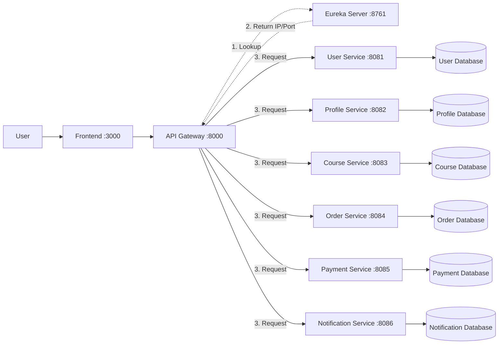

# Course Selling Website Microservices

[](https://github.com/hungdn1701/microservices-assignment-starter/stargazers)
[](https://github.com/hungdn1701/microservices-assignment-starter/network/members)
[](LICENSE)

> You can authenticate, register to the system, view and buy course and receive notification if success

> **New to this repo?** See [`GETTING_STARTED.md`](GETTING_STARTED.md) for setup instructions and workflow guide.

---

## Team Members

| Name | Student ID | Role | Contribution |
|------|------------|------|-------------|
|Đặng Quốc Khánh|B22DCCN444|Leader| Developing API Gateway, authentication at gateway, config Eureka Server, Developing buy course workflow (buy and get notifications)|
|Nguyễn Thế Lâm|B22DCCN480|Member| Updating...|

---

## Business Process

### **1.1. User Management**
* **Registration**: Users register, login, authenticate,... through the `User Service`, which handles core authentication data (username, password, roles).
* **Identity Provider**: Acts as the main service for **JWT issuance** and internal user validation (Introspect).

### **1.2. Profile Management**
* **Profile Creation**: Upon successful registration, the `Profile Service` is triggered to **Create a New Profile** record.
* **Scope**: This service focuses strictly on personal metadata (Full name, DOB, Bio). Currently, only the **Create** functionality is implemented.

### **1.3. Course Management (CRUD)**
* Administrators or Instructors can perform full **CRUD** (Create, Read, Update, Delete) operations on the course catalog via the `Course Service`.

### **1.4. Purchasing & Order Flow**
* **Order Initiation**: When a user selects "Buy Now," the `Order Service` generates a primary **Order** record.
* **Order Details**: The system simultaneously creates **Order Details**, capturing Course ID, price at the time of purchase, and associated metadata.

### **1.5. Payment & History**
* **Transaction Execution**: The `Payment Service` processes the transaction, verifying **User Information** (from User Service) and the required **Amount**.
* **Payment History**: Every transaction (success or failure) is logged into the **Payment History** for user tracking and auditing.

### **1.6. Success Notification**
* **Trigger**: Once the order is confirmed successful, a OrderCompleted event is sent to the `Notification Service`.
* **Action**: The service sends a **Success Notification** (Email/In-app) to the user.

---


## Architecture



| Component     | Responsibility | Tech Stack | Port |
|---------------|----------------|------------|------|
| **Frontend**  |                | JavaScript, React, HTML, CSS| 3000 |
| **Gateway**   |Routing to serivces, Authenticate, Ask and get IP/Port From Eureka|Spring Cloud Gateway, SpringBoot, HTTP Intefaces for non-blocking communication| 8000 |
| **Eureka Server** |Services Registry & Discovery, get request from Gateway and return IP/Port|SpringBoot, Eureka| 8761 |
| **User Service** |Authenticate, Authorization, register, logout, manage user|SpringBoot, Spring Security, OpenFeign for sync messaging, Resilence4j| 8081 |
| **Profile Service** |Manage user profile|SpringBoot, Spring Security, OpenFeign for sync messaging, Resilence4j| 8082 |
| **Course Service** |Manage course|SpringBoot, Spring Security, OpenFeign for sync messaging, Resilence4j| 8083 |
| **Order Service** |Manage order and order detail|SpringBoot, Spring Security, OpenFeign for sync messaging, Resilence4j| 8084 |
| **Payment Service** |Manage user payment information and payment history|SpringBoot, Spring Security, OpenFeign for sync messaging, Resilence4j| 8085 |
| **Notification Service** |Notification when buy course success|SpringBoot, Spring Security, Kafka for event and async messaging, Resilence4j| 8086 |

> Full documentation: [`docs/architecture.md`](docs/architecture.md) · [`docs/analysis-and-design-ddd.md`](docs/analysis-and-design-ddd.md)

---

## Getting Started

```bash
# Clone and initialize
git clone https://github.com/khanhLala/project-444480
cd project-444480
cp .env.example .env

# Build and run
docker compose up --build
```

### Verify

```bash
curl http://localhost:8000/actuator/health   # Gateway
curl http://localhost:8081/actuator/health   # User Service
curl http://localhost:8082/actuator/health   # Profile Service
curl http://localhost:8083/actuator/health   # Course Service
curl http://localhost:8084/actuator/health   # Order Service
curl http://localhost:8085/actuator/health   # Payment Service
curl http://localhost:8086/actuator/health   # Notification Service
```

---

## API Documentation
**Base URL**: `http://localhost:8000/api/v1`

- [User Service — OpenAPI Spec](docs/api-specs/user-service.yaml)
- [Profile Service — OpenAPI Spec](docs/api-specs/profile-service-b.yaml)
- [Course Service — OpenAPI Spec](docs/api-specs/course-service.yaml)
- [Order Service — OpenAPI Spec](docs/api-specs/order-service.yaml)
- [Payment Service — OpenAPI Spec](docs/api-specs/payment-service.yaml)
- [Notification Service — OpenAPI Spec](docs/api-specs/notification-service.yaml)

---

## License

This project uses the [MIT License](LICENSE).

> Template by [Hung Dang](https://github.com/hungdn1701) · [Template guide](GETTING_STARTED.md)

