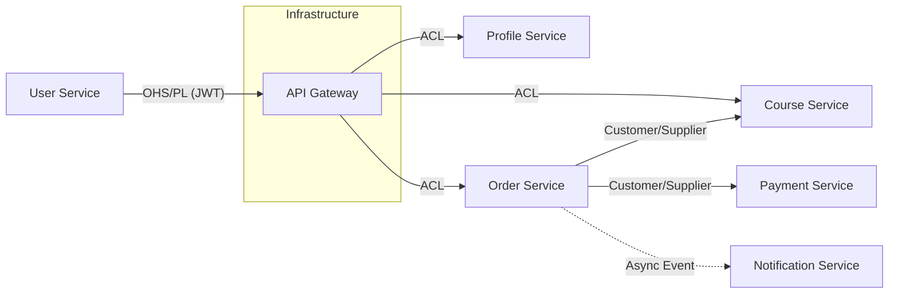
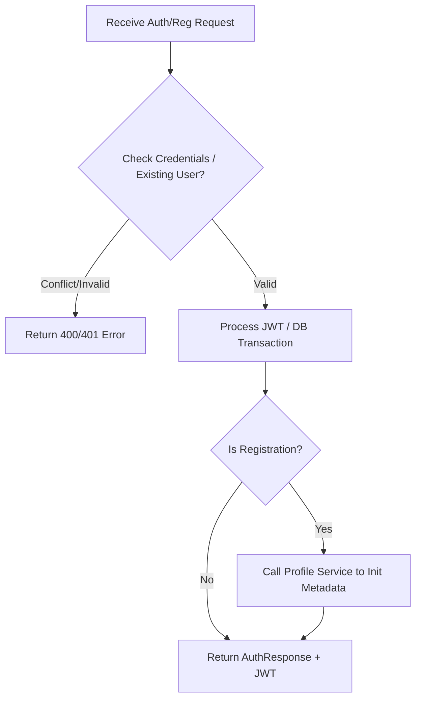
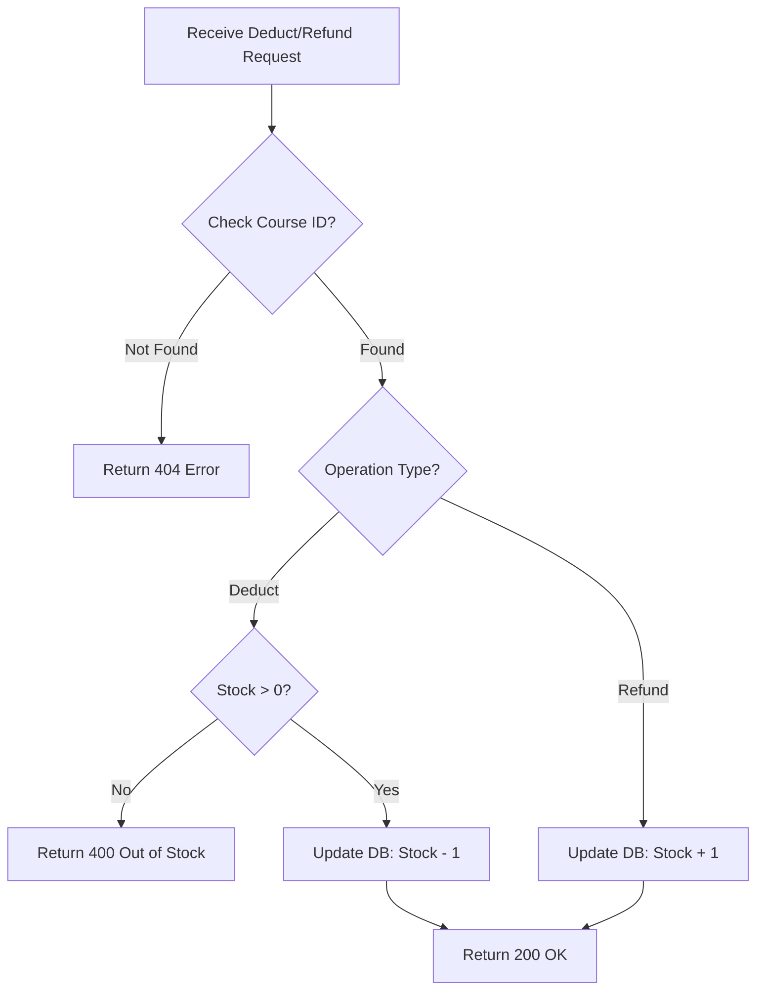
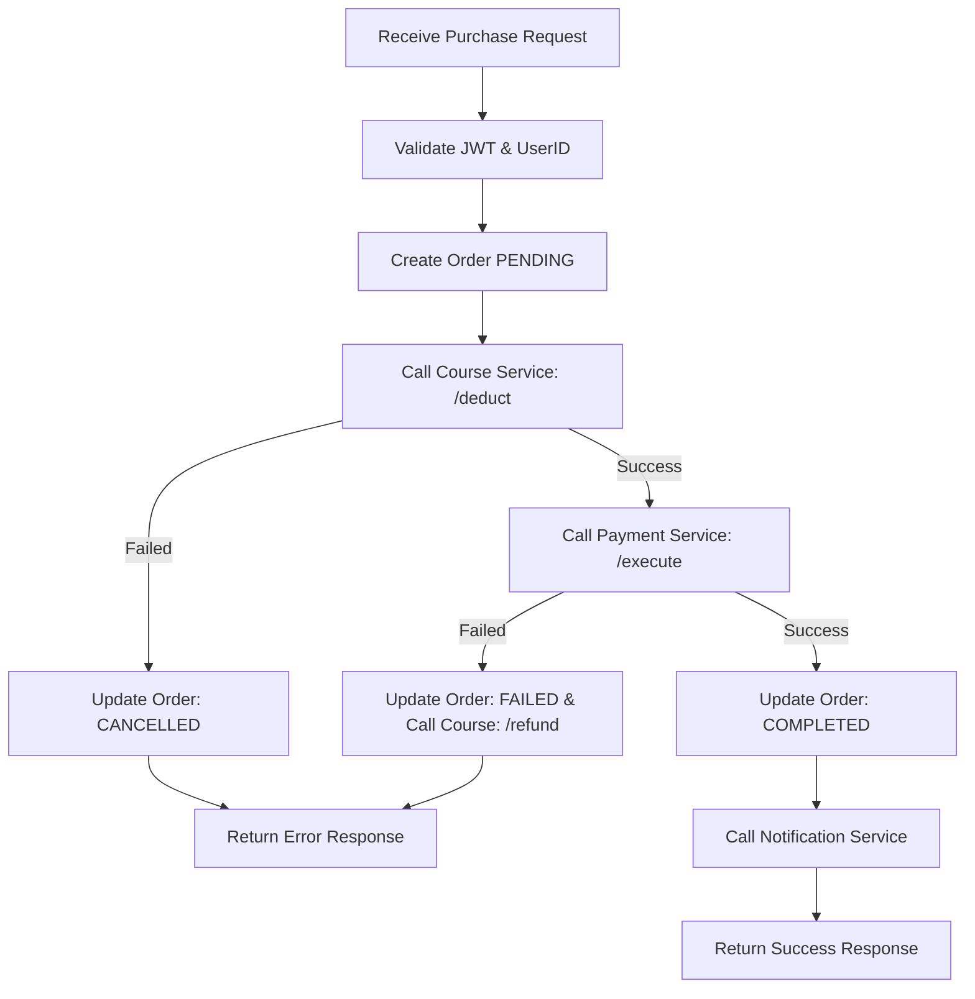
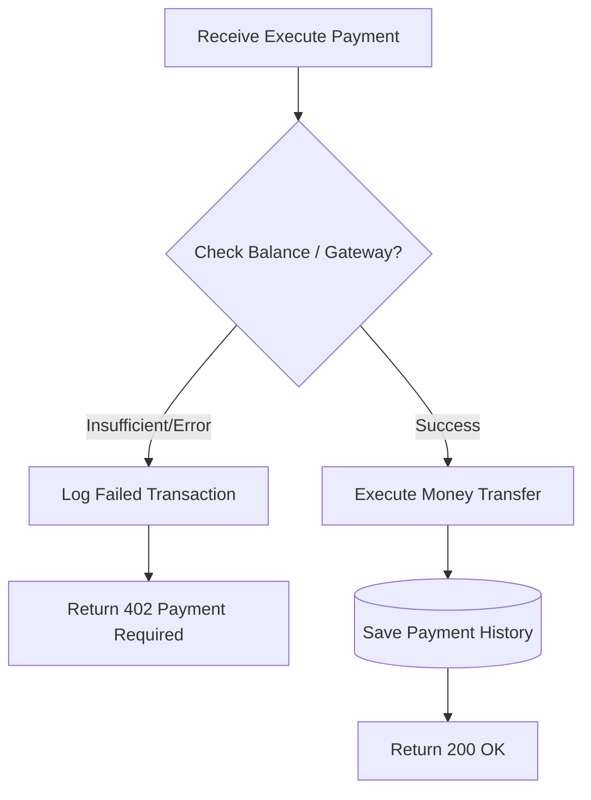
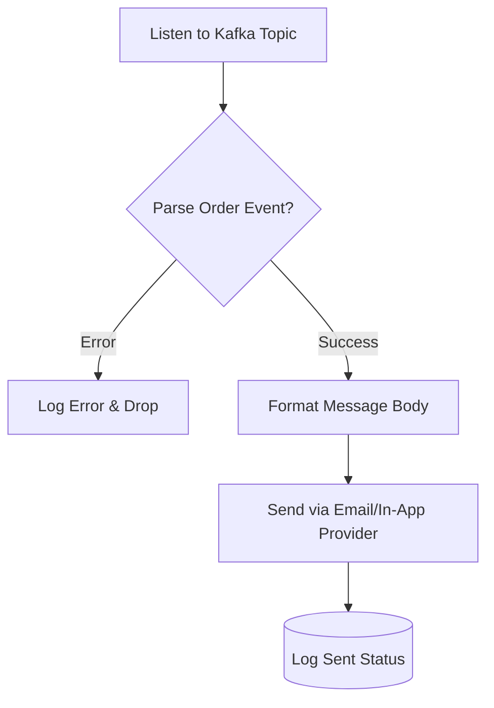

# Analysis and Design — Domain-Driven Design Approach

**References:**
1. *Domain-Driven Design: Tackling Complexity in the Heart of Software* — Eric Evans
2. *Microservices Patterns: With Examples in Java* — Chris Richardson
3. *Bài tập — Phát triển phần mềm hướng dịch vụ* — Hung Dang (available in Vietnamese)

---

## Part 1 — Domain Discovery

### 1.1 Business Process Definition

Describe or diagram the high-level Business Process to be automated.

- **Domain**: E-learning & Education Technology.
- **Business Process**: Online course enrollment and automated notification system.
- **Actors**: Student, Administrator, System.
- **Scope**: User authentication, Profile management, Course CRUD, Order placement, Payment processing, and Notification delivery.

**Process Diagram:**

*(Insert BPMN, flowchart, or image into `docs/asset/` and reference here)*

### 1.2 Existing Automation Systems
| System Name | Type | Current Role | Interaction Method |
|-------------|------|--------------|-------------------|
| None | N/A | The process is currently performed manually. | N/A |

### 1.3 Non-Functional Requirements

| Requirement | Description |
|----------------|-------------|
| Performance | Average response time < 500ms for internal service calls. |
| Security | Stateless authentication using JWT; Role-based access control (RBAC). |
| Scalability | Granular scaling of Course and Order services during high-traffic sales. |
| Availability | High availability using Eureka Service Discovery and Resilience4j. |

---

## Part 2 — Strategic Domain-Driven Design

### 2.1 Event Storming — Domain Events

List Domain Events in chronological order as they occur in the business process.

| # | Domain Event | Triggered By | Description |
|---|-------------|--------------|-------------|
| **1** | **UserRegistered** | User Service | New user account created and saved to DB. |
| **2** | **UserAuthenticated** | User Service | User credentials verified successfully. |
| **3** | **TokenIssued** | User Service | JWT Access/Refresh tokens generated for the session. |
| **4** | **TokenValidated** | API Gateway | Token checked and cleared for inter-service routing. |
| **5** | **UserUpdated** | User Service | Core account information modified. |
| **6** | **UserDeleted** | User Service | User account removed from the system. |
| **7** | **UserLoggedOut** | User Service | Token invalidated or cleared from the client-side/blacklist. |
| **8** | **ProfileCreated** | Profile Service | Personal metadata initialized (linked to UserID). |
| **9** | **CourseCreated** | Course Service | New course content and pricing defined by Admin. |
| **10**| **CourseRetrieved** | Course Service | Course details fetched (List or ByID) for the storefront. |
| **11**| **CourseUpdated** | Course Service | Existing course information modified. |
| **12**| **CourseRemoved** | Course Service | Course deleted from the catalog. |
| **13**| **OrderCreated** | Order Service | Order header and Details (Course/Price) persisted. |
| **14**| **OrderCompleted** | Order Service | Order marked as finished after successful payment. |
| **15**| **OrderFailed** | Order Service | Order canceled due to payment rejection or system error. |
| **16**| **PaymentSucceeded**| Payment Service | Transaction confirmed and History logged. |
| **17**| **PaymentFailed** | Payment Service | Transaction rejected; error status recorded. |
| **18**| **NotificationSent**| Notification Service | Success/Failure alert delivered to the user. |

---

### 2.2 Commands and Actors

What Commands trigger those Domain Events, and who issues them?

| Command | Actor | Triggers Event(s) |
|---------|-------|--------------------|
| **RegisterAccount** | User | UserRegistered, ProfileCreated |
| **Login** | User | UserAuthenticated, TokenIssued |
| **VerifyToken** | API Gateway | TokenValidated |
| **UpdateAccount** | User | UserUpdated |
| **DeleteAccount** | Admin/User | UserDeleted |
| **Logout** | User | UserLoggedOut |
| **CreateCourse** | Admin | CourseCreated |
| **ViewCourse** | User | CourseRetrieved |
| **UpdateCourse** | Admin | CourseUpdated |
| **DeleteCourse** | Admin | CourseRemoved |
| **InitiateOrder** | User | OrderCreated |
| **ProcessPayment** | Payment Service | PaymentSucceeded / PaymentFailed |
| **CompleteOrder** | Order Service | OrderCompleted / OrderFailed |
| **PushNotification**| Notification Service | NotificationSent |

---

### 2.3 Aggregates

Grouping related Commands and Events around the business entities (Aggregates) they operate on.

| Aggregate | Commands | Domain Events | Owned Data |
|-----------|----------|---------------|------------|
| **User** | RegisterAccount, Login, Logout, UpdateAccount, DeleteAccount | UserRegistered, UserAuthenticated, TokenIssued, UserUpdated, UserDeleted, UserLoggedOut | Username, Password, Roles, InvalidToken |
| **Profile** | InitProfile | ProfileCreated | FullName, DateOfBirth, Address, Bio, UserID |
| **Course** | CreateCourse, UpdateCourse, DeleteCourse, ViewCourse | CourseCreated, CourseUpdated, CourseRemoved, CourseRetrieved | Title, Description, Price, InstructorID, Status, Category |
| **Order** | InitiateOrder, CompleteOrder | OrderCreated, OrderCompleted, OrderFailed | OrderID, UserID, TotalAmount, Status, **OrderDetails** (CourseID, UnitPrice) |
| **Payment** | ProcessPayment | PaymentSucceeded, PaymentFailed | TransactionID, OrderID, Amount, PaymentMethod, PaymentHistory (Logs) |
| **Notification** | PushNotification | NotificationSent | NotificationID, UserID, MessageContent, SendTime, Status |

### 2.4 Bounded Contexts

Each Bounded Context defines a boundary where a specific domain model applies. In this architecture, each context directly maps to a Microservice.

| Bounded Context | Aggregates | Responsibility |
|-----------------|------------|----------------|
| **User Context** (User Service) | **User** | Quản lý định danh, xác thực (Login/Register) và cấp phát thẻ bài truy cập (JWT). |
| **Profile Context** (Profile Service) | **Profile** | Quản lý thông tin chi tiết của người dùng (Họ tên, tiểu sử) tách biệt với thông tin đăng nhập. |
| **Courưrse Context** (Course Service) | **Course** | Quản lý kho nội dung học tập, danh mục và giá cả của các khóa học. |
| **Order Context** (Order Service) | **Order** | Xử lý quy trình mua hàng, tạo hóa đơn và chốt các mặt hàng người dùng đã chọn. |
| **Payment Context** (Payment Service) | **Payment** | Thực hiện giao dịch tài chính, kiểm tra số dư và lưu lại lịch sử thanh toán (Audit Trail). |
| **Notification Context** (Notification Service) | **Notification** | Chịu trách nhiệm gửi thông điệp thành công/thất bại đến người dùng cuối. |

### 2.5 Context Map

Show relationships between Bounded Contexts.

### 2.5 Context Map

The following map illustrates the strategic relationships between the Bounded Contexts. Since the system utilizes Synchronous REST communication (via Feign Clients), the relationships are defined by data dependency and authority flow.

**Relationship types:** Upstream/Downstream, Customer/Supplier, Conformist, Anti-Corruption Layer (ACL), Shared Kernel, Open Host Service (OHS), Published Language.

| Upstream (U) | Downstream (D) | Relationship Type | Description |
| :--- | :--- | :--- | :--- |
| **User Service** | **API Gateway** | **OHS / PL** | User Service acts as an **Open Host Service** providing a **Published Language** (JWT) for the entire ecosystem. |
| **User Service** | **Profile Service** | **Customer / Supplier** | Profile Service depends on User Service to exist. When a user is created (Supplier), the profile is initialized (Customer). |
| **Course Service** | **Order Service** | **Customer / Supplier** | Order Service consumes Course data. Any change in Course pricing (Upstream) directly impacts Order calculations (Downstream). |
| **Order Service** | **Payment Service** | **Customer / Supplier** | Payment Service fulfills the transactional requirements initiated by the Order Service. |
| **Order Service** | **Notification Service** | **Downstream** | Notification Service reacts to the success/failure status provided by the Order Service. |
| **API Gateway** | **All Services** | **ACL** | The Gateway serves as an **Anti-Corruption Layer**, protecting internal domain models from external request "pollution." |

---

## Part 3 — Service-Oriented Design

### 3.1 Uniform Contract Design

Service Contract specification for each Bounded Context / service.
Full OpenAPI specs:
- [`docs/api-specs/user-service.yaml`](docs/api-specs/user-service.yaml)
- [`docs/api-specs/profile-service.yaml`](docs/api-specs/profile-service.yaml)
- [`docs/api-specs/course-service.yaml`](docs/api-specs/course-service.yaml)
- [`docs/api-specs/order-service.yaml`](docs/api-specs/order-service.yaml)
- [`docs/api-specs/payment-service.yaml`](docs/api-specs/payment-service.yaml)
- [`docs/api-specs/notification-service.yaml`](docs/api-specs/notification-service.yaml)

**Base URL**: `http://localhost:8000/api/v1`

**Service: User Service (Identity & Account Context)**

| Endpoint | Method | Media Type | Response Codes | Description |
| :--- | :--- | :--- | :--- | :--- |
| `/auth/login` | `POST` | `application/json` | 200, 401, **500** | Authenticate user and issue JWT. |
| `/auth/logout` | `POST` | `application/json` | 200, 401, **500** | Invalidate the current session/token. |
| `/auth/introspect` | `POST` | `application/json` | 200, 403, **500** | Verify token validity and status. |
| `/user/register` | `POST` | `application/json` | 201, 400, **500** | Register a new user account. |
| `/user/myInfo` | `GET` | `application/json` | 200, 401, **500** | Retrieve currently authenticated user info. |
| `/user` | `GET` | `application/json` | 200, 403, **500** | List all users (Admin/Authorized only). |
| `/user/{userId}` | `GET` | `application/json` | 200, 404, **500** | Retrieve specific user details by ID. |
| `/user/{userId}` | `PUT` | `application/json` | 200, 400, 404, **500** | Update existing user information. |
| `/user/{userId}` | `DELETE` | `application/json` | 200, 404, **500** | Remove a user account from the system. |
| `/internal/user/exists/{userId}` | `GET` | `application/json` | 200, **500** | Inter-service check for user existence (Boolean). |

---

**Service: Profile Service**

| Endpoint | Method | Media Type | Response Codes | Description |
| :--- | :--- | :--- | :--- | :--- |
| `/profile` | `POST` | `application/json` | 201, 400, 401, **500** | **Create** a new user profile linked to UserID. |

---

**Service: Course Service**

| Endpoint | Method | Media Type | Response Codes | Description |
| :--- | :--- | :--- | :--- | :--- |
| `/course` | `GET` | `application/json` | 200, 500 | Retrieve all courses with current **Stock/Quantity**. |
| `/course/{id}` | `GET` | `application/json` | 200, 404, 500 | Get details and available seats/slots for a course. |
| `/course` | `POST` | `application/json` | 201, 403, 500 | Create course with an initial **Stock** count. |
| `/course/deduct/{id}` | `POST` | `application/json` | 200, 400, 500 | **Purchase Flow**: Decrement stock (`Stock - 1`). |
| `/course/refund/{id}` | `POST` | `application/json` | 200, 400, 500 | **Refund Flow**: Increment stock (`Stock + 1`). |
---

**Service: Order Service**

| Endpoint | Method | Media Type | Response Codes | Description |
| :--- | :--- | :--- | :--- | :--- |
| `/order` | `POST` | `application/json` | 201, 400, **500** | **Place Order** (creates Order & OrderDetails). |
| `/order/{id}` | `GET` | `application/json` | 200, 404, **500** | View order status and details. |

---

**Service: Payment Service**

| Endpoint | Method | Media Type | Response Codes | Description |
| :--- | :--- | :--- | :--- | :--- |
| `/payment/execute` | `POST` | `application/json` | 200, 402, 401, **500** | Process payment with User/Amount info. |
| `/payment/history` | `GET` | `application/json` | 200, 401, **500** | View personal **Payment History**. |

---

**Service: Notification Service**

| Endpoint | Method | Media Type | Response Codes | Description |
| :--- | :--- | :--- | :--- | :--- |
| `/noti/send` | `POST` | `application/json` | 202, **500** | Dispatch success/failure alert to user. |

### 3.2 Service Logic Design (Internal Flow)

This section details the internal processing logic and inter-service coordination for each microservice.

#### 1. User & Profile Service Flow
This flow manages user identity verification and ensures that a corresponding profile is initialized immediately upon successful registration.

[Mermaid Diagram: User & Profile]

#### 2. Course Service Flow (Inventory Logic)
Acts as the Inventory Keeper. It ensures data integrity by preventing over-selling through strict stock-level validation.

[Mermaid Diagram: Course Service]

#### 3. Order Service Flow (The Orchestrator)
As the central Orchestrator, this service manages the transaction lifecycle and executes Compensating Transactions (Rollback) if the payment fails after stock deduction.

[Mermaid Diagram: Order Service]

#### 4. Payment Service Flow
Focuses on transaction execution and maintaining an immutable audit trail of all successful and failed financial events.

[Mermaid Diagram: Payment Service]

#### 5. Notification Service Flow
Handles the delivery of system alerts. It is designed to be non-blocking to maintain high availability for the upstream calling services.

[Mermaid Diagram: Notification Service]
