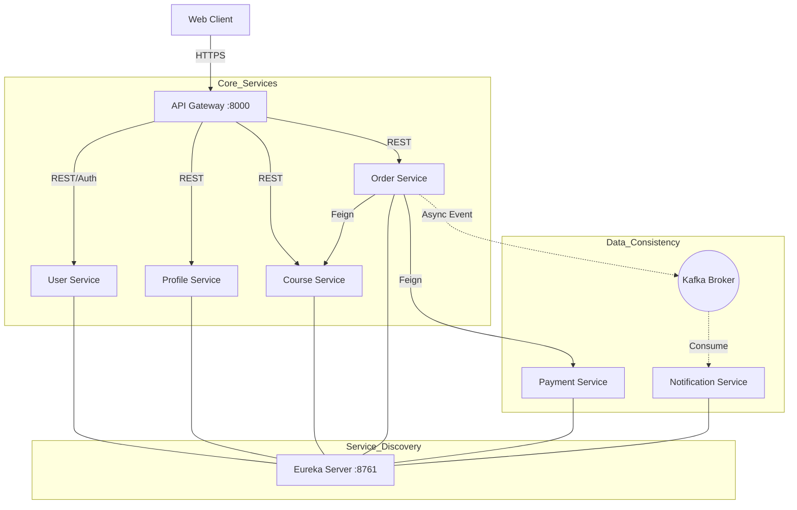

# System Architecture

> This document is completed **after** [Analysis and Design](analysis-and-design.md).
> Based on the Service Candidates and Non-Functional Requirements identified there, select appropriate architecture patterns and design the deployment architecture.

**References:**
1. *Service-Oriented Architecture: Analysis and Design for Services and Microservices* — Thomas Erl (2nd Edition)
2. *Microservices Patterns: With Examples in Java* — Chris Richardson
3. *Bài tập — Phát triển phần mềm hướng dịch vụ* — Hung Dang (available in Vietnamese)

---

## 1. Pattern Selection

Selected patterns based on the technical requirements of a distributed EdTech system.

| Pattern | Selected? | Business/Technical Justification |
|---------|-----------|----------------------------------|
| **API Gateway** | **Yes** | Centralized entry point for Authentication (JWT) and routing requests to internal services. |
| **Database per Service** | **Yes** | Ensures loose coupling; each service (User, Course, Order) owns its data and schema. |
| **Saga (Choreography)** | **Yes** | Handles distributed transactions for the Order-Payment-Stock flow using compensating updates. |
| **Event-driven (Kafka)** | **Yes** | Asynchronous communication for Notification service to ensure non-blocking performance. |
| **Circuit Breaker** | **Yes** | Implemented via **Resilience4j** to prevent cascading failures when a service (e.g., Payment) is down. |
| **Service Discovery** | **Yes** | **Netflix Eureka** allows services to find each other dynamically without hardcoded IPs. |
| **Externalized Config** | **Yes** | **Spring Cloud Config** for centralized management of environment variables across 6+ services. |

---

## 2. System Components

| Component | Responsibility | Tech Stack | Port |
|---------------|----------------|-----------------|-------|
| **Frontend** | User Interface | ReactJS | 3000 |
| **Gateway** | Routing & JWT Auth | Spring Cloud Gateway | 8000 |
| **Eureka Server**| Service Discovery | Netflix Eureka | 8761 |
| **Config Server**| Centralized Config | Spring Cloud Config | 8888 |
| **User Service** | Auth & Identity | Spring Boot, MySQL | 8081 |
| **Profile Service**| User Metadata | Spring Boot, MySQL | 8082 |
| **Course Service** | Inventory & Catalog| Spring Boot, MySQL | 8083 |
| **Order Service** | Orchestration | Spring Boot, MySQL | 8084 |
| **Payment Service**| Transactions | Spring Boot, MySQL | 8085 |
| **Noti Service** | Async Messaging | Spring Boot, Kafka | 8086 |

---

## 3. Communication

### Inter-service Communication Matrix

| From → To | Gateway | User Svc | Course Svc | Order Svc | Payment Svc | Noti Svc |
|-----------|---------|----------|------------|-----------|-------------|----------|
| **Frontend** | REST (JWT) | - | - | - | - | - |
| **Gateway** | - | REST | REST | REST | - | - |
| **User Svc** | - | - | - | - | - | - |
| **Order Svc** | - | Feign (Verify)| Feign (Stock)| - | Feign (Pay) | Kafka (Event)|
| **Payment Svc**| - | - | - | - | - | - |

---

## 4. Architecture Diagram

The system follows a decentralized microservices architecture with a shared Message Broker (Kafka) for asynchronous tasks.

---

## 5. Deployment

- All services containerized with Docker
- Orchestrated via Docker Compose
- Single command: `docker compose up --build`
